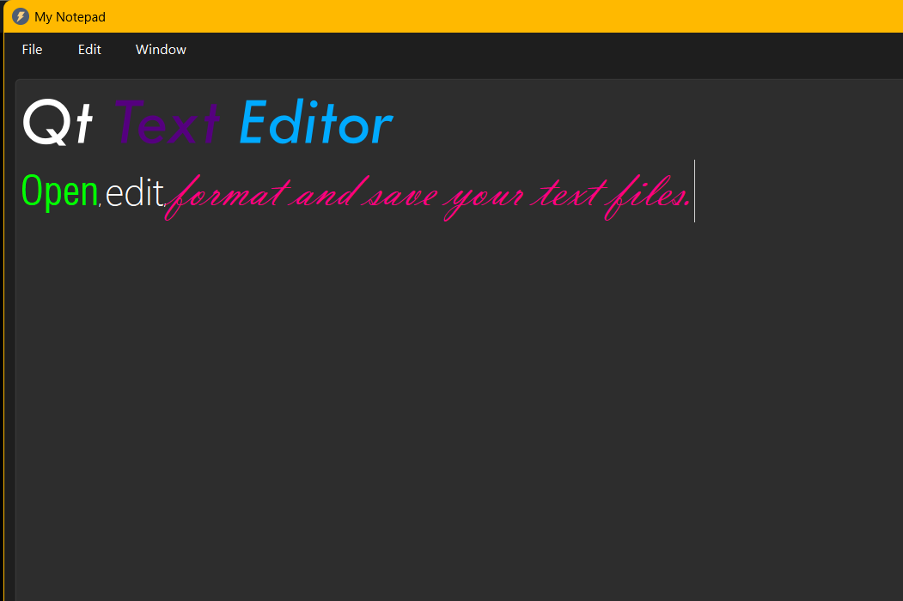

# Qt Text Editor

A desktop text editor developed in C++ using Qt Widgets.

The application provides file management, text editing, formatting and printing functionality through a simple graphical interface.

## Features

- Create a new text file
- Open existing text files
- Save files
- Save files using Save As
- Print documents
- Cut, copy and paste text
- Change font family, style and size
- Change text color
- Warning for unsaved changes before closing
- Custom icons and menu-based interface

## Technologies

- C++
- Qt 6
- Qt Widgets
- Qt Print Support
- qmake

## Screenshot

## How It Works

The application uses `QTextEdit` as the main text editing component.

File operations are implemented using `QFile`, `QTextStream` and `QFileDialog`.

Font and text color customization are implemented using `QFontDialog` and `QColorDialog`.

Printing functionality uses `QPrinter` and `QPrintDialog`.

Qt's signals and slots mechanism connects the menu actions to the corresponding application functionality.

The editor also tracks document modifications and warns the user if there are unsaved changes before the application is closed.

## Project Structure

- `main.cpp` - application entry point
- `mainwindow.h` - MainWindow class declaration
- `mainwindow.cpp` - application logic and UI functionality
- `Editor_programatic.pro` - Qt project configuration
- `Resources.qrc` - icons and application resources

## Running the Project

1. Open `Editor_programatic.pro` in Qt Creator.
2. Select a Qt 6 Desktop kit.
3. Build and run the project.

## Author

Dumitrina Rusu
